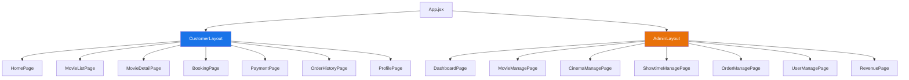

# T-Cine Frontend - Kế Hoạch Thiết Lập Dự Án

## Tổng Quan Đề Tài

Xây dựng **hệ thống quản lý và đặt vé xem phim trực tuyến** với 2 phần chính:
- **Phía khách hàng**: Tìm kiếm phim, xem chi tiết, đặt vé chọn ghế, theo dõi đơn hàng, chatbot AI tư vấn
- **Phía quản trị**: Quản lý phim, rạp/phòng chiếu, lịch chiếu, đơn hàng, doanh thu, người dùng

## Công Nghệ Frontend Đề Xuất

| Công nghệ | Mục đích |
|---|---|
| **React 19** + **Vite** | Framework & build tool |
| **React Router v7** | Điều hướng (routing) |
| **Zustand** | State management (nhẹ, đơn giản) |
| **Axios** | HTTP client gọi API |
| **React Query (TanStack Query)** | Server state, caching, data fetching |
| **React Hook Form** + **Zod** | Form handling & validation |
| **React Icons** | Bộ icon |
| **Swiper** | Carousel/slider cho banner phim |
| **React Toastify** | Thông báo (notification) |
| **Chart.js** + **react-chartjs-2** | Biểu đồ thống kê (admin) |
| **SCSS (Sass)** | Styling (nesting, variables, mixins) |
| **Google Gemini API** | Chatbot AI tư vấn phim |

> [!NOTE]
> Sử dụng **Vite** thay vì CRA vì tốc độ build nhanh hơn rất nhiều. **Zustand** được chọn thay Redux vì nhẹ, ít boilerplate và phù hợp với dự án đồ án. **SCSS** giúp tổ chức CSS tốt hơn với nesting và variables. Thanh toán chỉ mô phỏng (demo). Giao diện **tiếng Việt**.

## Cây Thư Mục Đề Xuất

```
d:\doan\frontend\
├── public/
│   ├── favicon.ico
│   └── images/                    # Ảnh tĩnh (logo, placeholder...)
│
├── src/
│   ├── api/                       # ✅ Tầng gọi API (Axios instances)
│   │   ├── axiosClient.js         # Cấu hình Axios chung (baseURL, interceptors)
│   │   ├── authApi.js             # API đăng ký, đăng nhập, logout
│   │   ├── movieApi.js            # API phim (CRUD, tìm kiếm, lọc)
│   │   ├── cinemaApi.js           # API rạp & phòng chiếu
│   │   ├── showtimeApi.js         # API lịch chiếu
│   │   ├── bookingApi.js          # API đặt vé, chọn ghế
│   │   ├── userApi.js             # API thông tin người dùng
│   │   ├── adminApi.js            # API quản trị (thống kê, doanh thu)
│   │   └── chatbotApi.js          # API chatbot AI
│   │
│   ├── assets/                    # Tài nguyên (fonts, SVG, ảnh dùng trong code)
│   │   ├── fonts/
│   │   ├── icons/
│   │   └── images/
│   │
│   ├── components/                # ✅ Components dùng chung (reusable)
│   │   ├── common/                # UI chung
│   │   │   ├── Button/
│   │   │   │   ├── Button.jsx
│   │   │   │   └── Button.module.scss
│   │   │   ├── Input/
│   │   │   ├── Modal/
│   │   │   ├── Loading/
│   │   │   ├── Pagination/
│   │   │   └── Card/
│   │   │
│   │   ├── layout/                # Layout components
│   │   │   ├── Header/
│   │   │   │   ├── Header.jsx
│   │   │   │   └── Header.module.scss
│   │   │   ├── Footer/
│   │   │   ├── Sidebar/           # Sidebar cho admin
│   │   │   ├── CustomerLayout.jsx # Layout chung cho khách hàng
│   │   │   └── AdminLayout.jsx    # Layout chung cho admin
│   │   │
│   │   └── features/              # Components theo chức năng
│   │       ├── movie/             # Components liên quan đến phim
│   │       │   ├── MovieCard.jsx
│   │       │   ├── MovieCard.module.scss
│   │       │   ├── MovieList.jsx
│   │       │   ├── MovieFilter.jsx
│   │       │   └── MovieTrailer.jsx
│   │       │
│   │       ├── booking/           # Components đặt vé
│   │       │   ├── SeatMap.jsx     # Sơ đồ ghế
│   │       │   ├── SeatMap.module.scss
│   │       │   ├── SeatLegend.jsx
│   │       │   ├── BookingSummary.jsx
│   │       │   └── ShowtimeSelector.jsx
│   │       │
│   │       ├── auth/              # Components xác thực
│   │       │   ├── LoginForm.jsx
│   │       │   ├── RegisterForm.jsx
│   │       │   └── ProtectedRoute.jsx
│   │       │
│   │       └── chatbot/           # Components chatbot AI
│   │           ├── ChatWidget.jsx
│   │           ├── ChatWidget.module.scss
│   │           ├── ChatMessage.jsx
│   │           └── ChatInput.jsx
│   │
│   ├── hooks/                     # ✅ Custom hooks
│   │   ├── useAuth.js             # Hook xác thực
│   │   ├── useMovies.js           # Hook fetch phim
│   │   ├── useBooking.js          # Hook đặt vé
│   │   └── useDebounce.js         # Hook debounce tìm kiếm
│   │
│   ├── pages/                     # ✅ Trang (mỗi route = 1 page)
│   │   ├── customer/              # --- Trang khách hàng ---
│   │   │   ├── HomePage/
│   │   │   │   ├── HomePage.jsx
│   │   │   │   └── HomePage.module.scss
│   │   │   ├── MovieListPage/     # Danh sách phim (đang chiếu / sắp chiếu)
│   │   │   ├── MovieDetailPage/   # Chi tiết phim
│   │   │   ├── BookingPage/       # Trang đặt vé (chọn ghế)
│   │   │   ├── PaymentPage/       # Trang thanh toán
│   │   │   ├── OrderHistoryPage/  # Lịch sử đặt vé
│   │   │   ├── ProfilePage/       # Thông tin cá nhân
│   │   │   └── CinemaListPage/    # Danh sách rạp
│   │   │
│   │   ├── auth/                  # --- Trang xác thực ---
│   │   │   ├── LoginPage.jsx
│   │   │   └── RegisterPage.jsx
│   │   │
│   │   └── admin/                 # --- Trang quản trị ---
│   │       ├── DashboardPage/     # Tổng quan & thống kê
│   │       ├── MovieManagePage/   # Quản lý phim (CRUD)
│   │       ├── CinemaManagePage/  # Quản lý rạp & phòng chiếu
│   │       ├── ShowtimeManagePage/# Quản lý lịch chiếu
│   │       ├── OrderManagePage/   # Quản lý đơn hàng/vé
│   │       ├── UserManagePage/    # Quản lý người dùng
│   │       └── RevenuePage/       # Thống kê doanh thu
│   │
│   ├── routes/                    # ✅ Cấu hình routing
│   │   ├── index.jsx              # Route chính
│   │   ├── customerRoutes.jsx     # Routes khách hàng
│   │   └── adminRoutes.jsx        # Routes quản trị
│   │
│   ├── store/                     # ✅ State management (Zustand)
│   │   ├── useAuthStore.js        # Auth state (user, token)
│   │   ├── useBookingStore.js     # Booking state (ghế đã chọn, suất chiếu)
│   │   └── useCartStore.js        # Cart/order state
│   │
│   ├── utils/                     # ✅ Hàm tiện ích
│   │   ├── constants.js           # Hằng số (API URL, seat types...)
│   │   ├── formatters.js          # Format tiền, ngày giờ
│   │   ├── validators.js          # Validate email, phone...
│   │   └── helpers.js             # Hàm hỗ trợ chung
│   │
│   ├── styles/                    # ✅ Styles toàn cục
│   │   ├── global.scss            # Reset CSS & styles toàn cục
│   │   ├── _variables.scss        # SCSS variables (màu, font, spacing)
│   │   ├── _mixins.scss           # SCSS mixins (responsive, flexbox...)
│   │   └── _animations.scss       # Keyframe animations
│   │
│   ├── App.jsx                    # Component gốc
│   ├── App.scss                   # Style cho App
│   └── main.jsx                   # Entry point (render React)
│
├── .env                           # Biến môi trường (API URL)
├── .env.example                   # Mẫu biến môi trường
├── .gitignore
├── index.html                     # HTML entry
├── package.json
├── vite.config.js                 # Cấu hình Vite
└── README.md
```

## Giải Thích Cấu Trúc

### Nguyên tắc tổ chức

| Thư mục | Vai trò | Nguyên tắc |
|---|---|---|
| `api/` | Gọi API backend | Mỗi file = 1 domain (phim, vé, rạp...) |
| `components/common/` | UI components tái sử dụng | Không chứa logic nghiệp vụ |
| `components/features/` | Components theo tính năng | Có thể chứa logic nghiệp vụ |
| `components/layout/` | Bố cục trang | Header, Footer, Sidebar, Layout wrappers |
| `pages/` | Các trang (views) | Mỗi route map với 1 page component |
| `hooks/` | Custom hooks | Tách logic ra khỏi component |
| `store/` | Global state | Zustand stores theo domain |
| `utils/` | Hàm tiện ích | Pure functions, không side-effects |
| `routes/` | Routing config | Tách riêng customer & admin routes |
| `styles/` | CSS toàn cục | Biến CSS, reset, animations |

### Phân chia theo 2 role chính



## Thứ Tự Triển Khai Đề Xuất

### Phase 1: Khởi tạo & Nền tảng
1. Khởi tạo project Vite + React
2. Cài đặt dependencies
3. Tạo cấu trúc thư mục
4. Setup CSS global (design system: màu sắc, font, spacing)
5. Setup Axios client & cấu hình API

### Phase 2: Layout & Routing
6. Tạo `CustomerLayout` (Header + Footer + Outlet)
7. Tạo `AdminLayout` (Sidebar + Header + Outlet)
8. Setup React Router (customer routes + admin routes)
9. Tạo ProtectedRoute component

### Phase 3: Trang Khách Hàng
10. HomePage (Hero banner, phim đang chiếu, phim sắp chiếu)
11. MovieListPage (danh sách + filter + tìm kiếm)
12. MovieDetailPage (thông tin chi tiết + trailer)
13. Auth pages (Login + Register)
14. BookingPage (chọn suất chiếu + sơ đồ ghế)
15. PaymentPage
16. OrderHistoryPage
17. ProfilePage
18. Chatbot Widget

### Phase 4: Trang Quản Trị
19. DashboardPage (overview + charts)
20. MovieManagePage (CRUD phim)
21. CinemaManagePage (CRUD rạp/phòng)
22. ShowtimeManagePage (CRUD lịch chiếu)
23. OrderManagePage (quản lý vé)
24. UserManagePage (quản lý tài khoản)
25. RevenuePage (thống kê doanh thu)

## Các Quyết Định Đã Xác Nhận ✅

| Hạng mục | Quyết định |
|---|---|
| **Styling** | SCSS (Sass) + SCSS Modules |
| **State management** | Zustand |
| **Tên hiển thị** | T-Cine |
| **Thanh toán** | Mô phỏng (mock) — chỉ demo |
| **Chatbot AI** | Google Gemini API |
| **Ngôn ngữ giao diện** | Tiếng Việt |
